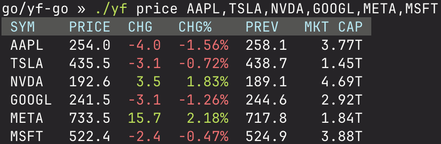

# yf-go

[](https://github.com/komsit37/yf-go/actions/workflows/ci.yml)

Small Yahoo Finance tool for Go with two uses:
- CLI `yf` for prices and quote summaries
- Library `github.com/komsit37/yf-go` (`yfgo`) for a reusable client

## Usage

### 1. CLI: run the `yf` command for quick queries.

#### Build
- From source: `go build -o yf ./cmd/yf`
- With Make: `make build`

#### Examples
- Price (table): `./yf price AAPL,TSLA,NVDA,GOOGL,META,MSFT`


- Quote summary (JSON pretty): `./yf qs AAPL -o json --pretty`
- Quote summary (table) with modules: `./yf qs AAPL -m assetProfile -o table`
- List supported [modules](quotesummary_modules.go): `./yf qs --list-modules`
- Chart data (JSON pretty): `./yf chart AAPL --range 5d --interval 1h --pretty`
- Chart data (table): `./yf chart AAPL --range 1mo --interval 1d -o table`

For typed access in Go code you can use `ChartTyped` for normalized time-series data.

#### Caching

The CLI caches Yahoo Finance responses by default for five minutes, writing entries to `$YF_HOME/cache` (or `~/.yf/cache` when `YF_HOME` is unset). Control this behaviour with flags or environment variables:

- `--cache-ttl` / `YF_CACHE_TTL` (duration, e.g. `30s`, `5m`) — set to `0` to disable caching.
- `--cache-dir` / `YF_CACHE_DIR` — override the cache directory (defaults to `$YF_HOME/cache`).
- `--force-refresh` / `YF_FORCE_REFRESH` — bypass the cache read but refresh the stored value.
- `--no-cache` / `YF_NO_CACHE` — bypass reads and writes entirely for the invocation.

### 2. Library: import `github.com/komsit37/yf-go` (package `yfgo`) in your Go code.

Example (library):

```go
package main

import (
    "context"
    "fmt"
    "time"

    "github.com/komsit37/yf-go"
)

func main() {
    ctx, cancel := context.WithTimeout(context.Background(), 10*time.Second)
    defer cancel()

    c := yfgo.NewClient()

    // Example 1: v7 quote for multiple symbols
    quotes, err := c.Quote(ctx, []string{"AAPL", "TSLA"})
    if err != nil {
        panic(err)
    }
    for _, q := range quotes {
        if q.RegularMarketPrice != nil {
            fmt.Printf("%s: %.2f\n", q.Symbol, *q.RegularMarketPrice)
        } else {
            fmt.Printf("%s: n/a\n", q.Symbol)
        }
    }

    // Example 2: v10 quoteSummary typed view
    ts, err := c.QuoteSummaryTyped(ctx, "AAPL", []yfgo.QuoteSummaryModule{yfgo.ModulePrice, yfgo.ModuleSummaryDetail})
    if err != nil {
        panic(err)
    }
    if ts.Price != nil {
        fmt.Printf("AAPL prev close: %s\n", ts.Price.RegularMarketPreviousClose.Fmt)
    }
}
```

#### Library caching

`yfgo.NewClient()` now includes an in-memory cache with a five minute TTL. You can customise or disable it:

```go
// Disable caching entirely.
client := yfgo.NewClient(yfgo.WithCacheDisabled())

// Use a 2 minute TTL with a file-backed cache directory.
store, err := yfgo.NewFileCacheStore("./cache-dir")
if err != nil {
    panic(err)
}
cachedClient := yfgo.NewClient(
    yfgo.WithCacheStore(store),
    yfgo.WithDefaultCacheTTL(2*time.Minute),
)
```

Per-call overrides are also available via request options:

```go
ctx := yfgo.WithCacheOptions(context.Background(), yfgo.CacheTTL(10*time.Second))
quote, err := client.Quote(ctx, []string{"AAPL"})
```

## Development
- Format: `make fmt` (Go’s canonical tabs; enforced by pre-commit and CI)
- Imports: `make imports` (requires `goimports`; `go install golang.org/x/tools/cmd/goimports@latest`)
- Verify: `make check` (fmt/imports/vet)
- Tests: `go test ./... -race -v`
- Optional pre-commit hook:
  - `git config core.hooksPath .githooks && chmod +x .githooks/pre-commit`

## Project Layout
- `cmd/yf/main.go` — CLI entrypoint
- root package (`github.com/komsit37/yf-go`) — Yahoo Finance client and types (domain logic)
- `refs/` — Upstream references/fixtures (not part of the build)
