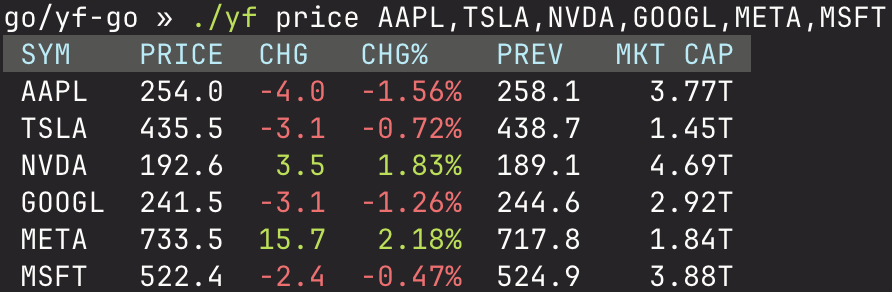

# yf-go

[](https://github.com/komsit37/yf-go/actions/workflows/ci.yml)

Small Yahoo Finance tool for Go with two uses:
- CLI `yf` for prices and quote summaries
- Library `github.com/komsit37/yf-go` (`yfgo`) for a reusable client

## Usage

### 1. CLI: run the `yf` command for quick queries.

#### Build
- From source: `go build -o yf ./cmd/yf`
- With Make: `make build`

#### Examples
- Price (table): `./yf price AAPL,TSLA,NVDA,GOOGL,META,MSFT`


- Quote summary (JSON pretty): `./yf qs AAPL -f json --pretty`
- Quote summary (table) with modules: `./yf qs AAPL -m assetProfile -f table`
- List supported [modules](quotesummary_modules.go): `./yf qs --list-modules`
- Chart data (JSON pretty): `./yf chart AAPL --range 5d --interval 1h --pretty`
- Chart data (table): `./yf chart AAPL --range 1mo --interval 1d -f table`
- Chart PNG for a preview pane: `./yf chart JP:7203 --range 6mo --interval 1d --width 900 --height 420 --render auto`
- Chart PNG to a chosen file: `./yf chart US:AAPL --range 5d --interval 1h --render ./aapl.png`

All symbol arguments accept canonical IDs: `JP:7203` becomes `7203.T`, and `US:AAPL` becomes `AAPL`. Prefixes are case insensitive. Yahoo symbols such as `7203.T`, `^N225`, and `BRK-B`, and other prefixes pass through unchanged. This normalization also applies to the Go client and cache keys.

`chart --render <path|auto>` writes a candlestick PNG with volume, price/date axes, exchange-local dates, previous close, and the last close and percentage change. It prints **only the absolute PNG path** to stdout, independently of `--format`. `--width` and `--height` default to 900 and 420 pixels; dimensions must be at least 320 x 200, at most 8192 per side and 32 million pixels total. Existing range, interval, and period flags select the data to render. A bare `--render` requires a value.

For typed access in Go code you can use `ChartTyped` for normalized time-series data.

#### Caching

The CLI caches Yahoo Finance responses by default for five minutes, writing entries to `$YF_HOME/cache` (or `~/.yf/cache` when `YF_HOME` is unset). Chart data defaults to four hours for daily or longer intervals and one minute for intraday intervals. An explicit TTL overrides these defaults. Control this behaviour with flags or environment variables:

- `--cache-ttl` / `YF_CACHE_TTL` (duration, e.g. `30s`, `5m`) — set to `0` to disable caching.
- `--cache-dir` / `YF_CACHE_DIR` — override the cache directory (defaults to `$YF_HOME/cache`).
- `--force-refresh` / `YF_FORCE_REFRESH` — bypass the cache read but refresh the stored value.
- `--no-cache` / `YF_NO_CACHE` — bypass reads and writes entirely for the invocation.

Rendered PNGs are cached in `<cache-dir>/render/` by normalized symbol, chart query, dimensions, and renderer version. `--render auto` returns the cached file path; a chosen output path receives an atomic copy. Render expiry follows the source chart data's TTL and fetch time. `--force-refresh` refreshes both data and PNG. With `--no-cache` or a nonpositive TTL, `--render auto` returns a fresh temporary PNG; callers should remove that file after use.

Quote summary modules are cached individually. Configure module-specific TTLs via your config file:

```yaml
cache:
  module-ttls:
    price: 30s
    assetProfile: 6h
```

Set a module TTL to `0` (or a negative duration) to disable caching for that module. The same behaviour is available from code with `yfgo.WithQuoteSummaryModuleTTLs`.

### 2. Library: import `github.com/komsit37/yf-go` (package `yfgo`) in your Go code.

Example (library):

```go
package main

import (
    "context"
    "fmt"
    "time"

    "github.com/komsit37/yf-go"
)

func main() {
    ctx, cancel := context.WithTimeout(context.Background(), 10*time.Second)
    defer cancel()

    c := yfgo.NewClient()

    // Example 1: v7 quote for multiple symbols
    quotes, err := c.Quote(ctx, []string{"AAPL", "TSLA"})
    if err != nil {
        panic(err)
    }
    for _, q := range quotes {
        if q.RegularMarketPrice != nil {
            fmt.Printf("%s: %.2f\n", q.Symbol, *q.RegularMarketPrice)
        } else {
            fmt.Printf("%s: n/a\n", q.Symbol)
        }
    }

    // Example 2: v10 quoteSummary typed view
    ts, err := c.QuoteSummaryTyped(ctx, "AAPL", []yfgo.QuoteSummaryModule{yfgo.ModulePrice, yfgo.ModuleSummaryDetail})
    if err != nil {
        panic(err)
    }
    if ts.Price != nil {
        fmt.Printf("AAPL prev close: %s\n", ts.Price.RegularMarketPreviousClose.Fmt)
    }
}
```

#### Library caching

`yfgo.NewClient()` now includes an in-memory cache with a five minute TTL. You can customise or disable it:

```go
// Disable caching entirely.
client := yfgo.NewClient(yfgo.WithCacheDisabled())

// Use a 2 minute TTL with a file-backed cache directory.
store, err := yfgo.NewFileCacheStore("./cache-dir")
if err != nil {
    panic(err)
}
cachedClient := yfgo.NewClient(
    yfgo.WithCacheStore(store),
    yfgo.WithDefaultCacheTTL(2*time.Minute),
    yfgo.WithQuoteSummaryModuleTTLs(map[yfgo.QuoteSummaryModule]time.Duration{
        yfgo.ModulePrice:        30 * time.Second,
        yfgo.ModuleAssetProfile: 6 * time.Hour,
    }),
)
```

Per-call overrides are also available via request options:

```go
ctx := yfgo.WithCacheOptions(context.Background(), yfgo.CacheTTL(10*time.Second))
quote, err := client.Quote(ctx, []string{"AAPL"})
```

Chart calls use the interval-specific TTLs above unless `WithDefaultCacheTTL` or a request `CacheTTL` overrides them. Render a previously fetched result, or fetch and reuse the file cache in one call:

```go
err := yfgo.RenderChartPNG(result, yfgo.RenderOptions{
    Path: "chart.png", Width: 900, Height: 420,
})
// Use a client with NewFileCacheStore to cache rendered PNGs too.
path, err := cachedClient.ChartPNG(context.Background(), "JP:7203",
    yfgo.ChartOptions{Range: "6mo", Interval: "1d"},
    yfgo.RenderOptions{Path: "auto"})
```

## Development
- Format: `make fmt` (Go’s canonical tabs; enforced by pre-commit and CI)
- Imports: `make imports` (requires `goimports`; `go install golang.org/x/tools/cmd/goimports@latest`)
- Verify: `make check` (fmt/imports/vet)
- Tests: `make test` (or `make test TEST_ARGS='-race -v'`)
- Update renderer goldens: `make golden` (runs the golden tests with `-update`)
- Optional pre-commit hook:
  - `git config core.hooksPath .githooks && chmod +x .githooks/pre-commit`

## Project Layout
- `cmd/yf/main.go` — CLI entrypoint
- root package (`github.com/komsit37/yf-go`) — Yahoo Finance client and types (domain logic)
- `refs/` — Upstream references/fixtures (not part of the build)
